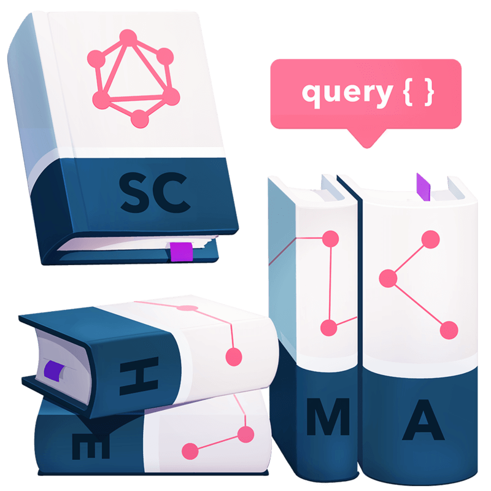

# GraphQL Query Language Course Notes

This repo contains notes and code snippets taken from Eve Porcello's GraphQL Query Language course. There is a link to the video at the top and a link to resources at the bottom. This is a public resource so you can add and update or futher clarify.

### Feel free to submit a PR! 🙌
